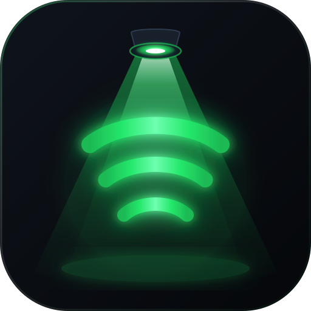
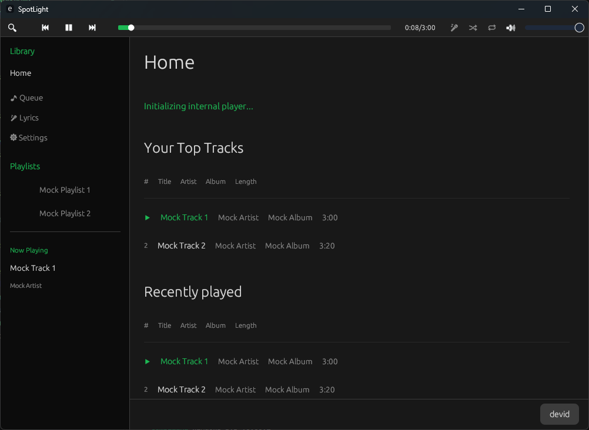
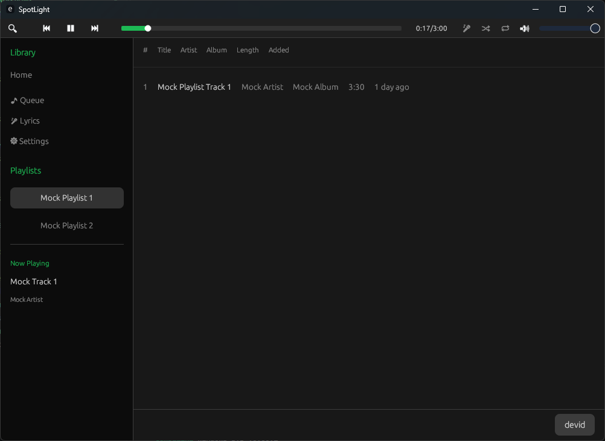

<div align="center">
  
  <h1>SpotLight</h1>
  <p><strong>A blazingly fast, ultra-lightweight Spotify client written in Rust.</strong></p>
</div>

---

## Why SpotLight?

I love Spotify, but I don't love how a background music player can easily eat up a gigabyte of RAM and unnecessarily drain my laptop's battery. The official desktop app is built on web technologies (CEF/Electron), which is great for cross-platform development, but terrible for resource efficiency. 

I wanted something native, fast, and incredibly light. No embedded web browsers, no Javascript engines. Just pure Rust. 

**The primary goal of this app is not to have the most features or the most beautiful UI, but rather to function in the most lightweight and resource-efficient way possible.**

### The Numbers Speak for Themselves:
| Metric | SpotLight | Official Spotify Desktop |
| --- | --- | --- |
| **Binary Size** | ~22.5 MB (Standalone) | 400+ MB |
| **RAM Usage** | ~60 MB | 500 MB - 1.5 GB |
| **CPU Usage** | Near 0% | Moderate (Background processes) |

Because SpotLight is built with `egui`, the UI completely goes to sleep when you aren't interacting with it. No wasted GPU or CPU cycles.

---

## Features

- **Native Playback:** Full audio playback powered by `librespot` (Spotify Premium required).
- **Perfect Synced Lyrics:** Real-time, time-synced lyrics that automatically scroll exactly like the official app (powered by LRCLIB).
- **Custom Themes:** Unhappy with the default green? Pick any accent color you want straight from the settings.
- **Native Media Controls:** Full integration with Windows System Media Transport Controls (SMTC) and MPRIS. Play, pause, or skip tracks right from your keyboard.
- **Privacy First:** Your Spotify credentials and API tokens are never sent to a third-party server. Everything is encrypted and safely stored in your native Credential Manager.

---

## Screenshots

<details>
<summary>Click to view screenshots</summary>


*The main home view.*


*The perfectly synced lyrics view.*

</details>

---

## Getting Started

Since SpotLight relies on Spotify's Web API and playback infrastructure, you need to provide your own Spotify Developer credentials. Don't worry, it only takes a minute.

### 1. Create a Spotify App
1. Go to the [Spotify Developer Dashboard](https://developer.spotify.com/dashboard).
2. Log in and click **"Create App"**.
3. Name it `SpotLight` (or whatever you prefer) and set the description.
4. **Crucial Step:** Set the **Redirect URI** to exactly `http://127.0.0.1:8888/callback`.
5. Check the Developer Terms of Service and hit Save.
6. Open the app settings to view your **Client ID** and **Client Secret**.

### 2. Run SpotLight
You can download the latest standalone executable from the [Releases](https://github.com/dddevid/SpotLight/releases) page, or compile it from source:

```bash
cargo run --release
```

On first launch, SpotLight will ask you for the **Client ID** and **Client Secret** you just generated. Paste them in, click "Login", and authorize the app in your browser. You're good to go!

---

## Tech Stack

This wouldn't be possible without the incredible Rust open-source ecosystem:
- **[egui](https://github.com/emilk/egui):** The immediate mode GUI library that makes this app so snappy.
- **[librespot](https://github.com/librespot-org/librespot):** The open-source Spotify client library handling the heavy lifting of audio playback.
- **[tokio](https://tokio.rs/):** For handling asynchronous API requests smoothly.
- **[keyring](https://crates.io/crates/keyring):** To ensure your API secrets are stored securely in the OS vault.

---

troubleshooting

macOS: "Spotverlay is damaged and can't be opened" This is a standard macOS Gatekeeper error for apps downloaded outside the Mac App Store that don't have a paid Apple Developer certificate. It's not actually damaged, it's just quarantined. To fix it, download the .dmg and drag the app into your Downloads folder (not Applications yet). Then open your Terminal and run:

xattr -cr ~/Downloads/Spotverlay.app

Now you can move it to your Applications folder and open it normally.

---

## Disclaimer
SpotLight is a personal, open-source project and is **not** affiliated with, endorsed by, or in any way associated with Spotify AB. This app uses `librespot` for playback, which may technically violate Spotify's Terms of Service if used outside of personal, non-commercial environments. Use at your own risk. 
